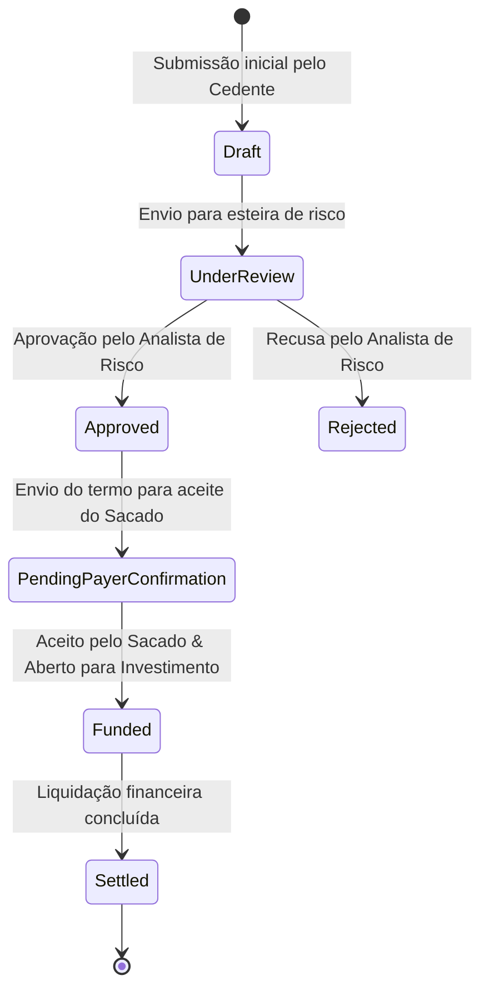

# 🏦 Dupply Backend — Plataforma de Registro & Análise de Recebíveis

O **Dupply Backend** é a infraestrutura de serviços financeiros da plataforma **Dupply**, projetada para transformar duplicatas mercantis e de serviços (invoices/recebíveis) em ativos digitais líquidos, auditáveis e rastreáveis. 

A aplicação conecta **Cedentes** (empresas em busca de capital de giro), **Analistas de Risco** (responsáveis pela avaliação de crédito assistida por Inteligência Artificial), **Administradores** e **Investidores** em um ambiente seguro, combinando alta performance HTTP (Fastify), persistência relacional flexível (Drizzle ORM com SQLite e PostgreSQL) e registro imutável em blockchain via **Smart Contracts na rede Stellar/Soroban**.

---

## 📑 Sumário

- [Visão Geral & Modelo de Negócio](#-visão-geral--modelo-de-negócio)
- [Arquitetura & Tecnologias](#-arquitetura--tecnologias)
- [Ciclo de Vida do Recebível (Duplicata)](#-ciclo-de-vida-do-recebível-duplicata)
- [Módulos e Perfis de Acesso (RBAC)](#-módulos-e-perfis-de-acesso-rbac)
- [Integração com Agentes de IA](#-integração-com-agentes-de-ia)
- [Estrutura do Repositório](#-estrutura-do-repositório)
- [Guia de Instalação e Configuração](#-guia-de-instalação-e-configuração)
- [Documentação Detalhada da API (Endpoints v1)](#-documentação-detalhada-da-api-endpoints-v1)
- [Smart Contracts Soroban (Rust)](#-smart-contracts-soroban-rust)
- [Banco de Dados & Migrações (Drizzle ORM)](#-banco-de-dados--migrações-drizzle-orm)
- [Testes e Scripts Utilitários](#-testes-e-scripts-utilitários)

---

## 🌐 Visão Geral & Modelo de Negócio

No mercado brasileiro, pequenas e médias empresas frequentemente enfrentam gargalos de caixa causados por prazos longos de pagamento de faturas (30, 60 ou 90 dias). A antecipação tradicional de duplicatas costuma ser burocrática, opaca e sujeita a altas taxas de intermediação.

O **Dupply** resolve essa dor ao:
1. **Digitalizar e Normalizar Duplicatas**: Validação de notas fiscais (NF-e, NFS-e) e comprovantes de entrega/prestação de serviço.
2. **Avaliação Automatizada por IA**: Orquestração de agentes de IA para emissão de dossiês cadastrais, relatórios financeiros (DRE/Balancete) e matriz SWOT em tempo real.
3. **Registro Imutável em Blockchain**: Emissão e custódia digital de *trade bills* via Soroban na rede Stellar.
4. **Liquidez Descentralizada & Ramp Financeiro**: Conexão com investidores e ramps de ativos digitais (Etherfuse) para liquidação rápida.

---

## 🏗️ Arquitetura & Tecnologias

A aplicação segue princípios de **DDD (Domain-Driven Design)** e **CQRS (Command Query Responsibility Segregation)** para garantir separação clara de responsabilidades, alta testabilidade e manutenibilidade.

```text
               ┌─────────────────────────────────────────┐
               │           Dupply Frontend (React)       │
               └────────────────────┬────────────────────┘
                                    │ HTTP / REST API (JWT)
                                    ▼
┌────────────────────────────────────────────────────────────────────────┐
│                        Dupply Backend (Fastify)                        │
│                                                                        │
│  ┌───────────────────────┐  ┌──────────────────┐  ┌─────────────────┐ │
│  │ Auth & Accounts        │  │ Receivables      │  │ Etherfuse Ramp  │ │
│  └───────────────────────┘  └──────────────────┘  └─────────────────┘ │
│  ┌───────────────────────┐  ┌──────────────────┐  ┌─────────────────┐ │
│  │ AI Webhook Receiver    │  │ Seller Registry  │  │ Trade Bill Sync │ │
│  └───────────────────────┘  └──────────────────┘  └─────────────────┘ │
└──────────────┬────────────────────┬────────────────────┬───────────────┘
               │                    │                    │
               ▼                    ▼                    ▼
     ┌──────────────────┐  ┌──────────────────┐  ┌───────────────────────┐
     │  SQLite / PG DB  │  │ n8n / Agent IA   │  │ Stellar Soroban Node │
     │  (Drizzle ORM)   │  │ (Webhook Receiver│  │ (TradeBillRegistry)  │
     └──────────────────┘  └──────────────────┘  └───────────────────────┘
```

### Stack Tecnológica

- **Runtime**: Node.js v22+ (utilizando módulos nativos ESM).
- **Framework Web**: Fastify v5 (alta performance HTTP, serialização rápida e ecossistema de plugins).
- **Validação & Tipagem**: Zod + `fastify-type-provider-zod` para inferência de tipos end-to-end.
- **ORM / Persistência**: Drizzle ORM — suporte duplo a **SQLite** (ambiente local de alta agilidade) e **PostgreSQL / Supabase** (produção/staging).
- **Autenticação**: Tokens JWT (Access Token + Refresh Token armazenado de forma segura).
- **Criptografia & Hashes**: Argon2 para hashing de senhas.
- **Blockchain Core**: `@stellar/stellar-sdk` v14 e Workspace Rust com Soroban SDK.

---

## 🔄 Ciclo de Vida do Recebível (Duplicata)

Cada duplicata submetida à plataforma percorre uma esteira rigorosa de validação:



---

## 👥 Módulos e Perfis de Acesso (RBAC)

A API aplica controle de acesso baseado em funções (Role-Based Access Control):

| Perfil | Identificador | Responsabilidades & Permissões |
|--------|---------------|────────────────────────────────|
| **Cedente** | `seller` | Cadastra dados da empresa, envia duplicatas/NFS-e, acompanha aceite do sacado e aprova propostas de antecipação. |
| **Analista de Risco** | `riskAnalyst` | Avalia dados do cedente, consulta o parecer emitido pelo Agente de IA, define taxas e prazos via wizard de aprovação. |
| **Administrador** | `admin` | Supervisão geral da plataforma, libera ofertas prontas para mercado, gerencia transações internas e contas. |
| **Investidor** | `investor` | Visualiza mercado de oportunidades, aplica aportes em cotas de duplicatas e gerencia carteira de rendimentos. |

---

## 🤖 Integração com Agentes de IA

O backend atua como repositório e centralizador das análises de risco automatizadas. Quando um cedente envia uma duplicata, o Agente de IA (orquestrado via n8n) processa as informações e envia os resultados via Webhook:

- **`aiReport` (JSON)**:
  - **Descrição da Empresa**: Atividade, fundação e composição societária.
  - **Análise SWOT**: Pontos fortes, fraquezas, oportunidades e ameaças calculadas.
  - **Demonstrativo Financeiro (DRE)**: Faturamento 12m, margem operacional, liquidez corrente e índice de endividamento.
  - **Pontuação de Risco (Score)**: Nota calculada para o cedente e para a duplicata.
  - **Carteira de Clientes & Fornecedores**: Percentuais de concentração comercial.
- **`aiReportPdfUrl` (String/URL)**: Link direto para o PDF oficial formatado em papel timbrado Dupply para auditoria humana.

---

## 📁 Estrutura do Repositório

```text
dupply-backend/
├── src/
│   ├── modules/                     # Módulos encapsulados por domínio
│   │   ├── auth/                    # Login, refresh token, perfis e hashing
│   │   ├── account/                 # Contas de usuário e credenciais
│   │   ├── seller/                  # Perfil do cedente e onboarding comercial
│   │   ├── receivable/              # Regras de negócio, comandos e consultas de duplicatas
│   │   ├── investor/                # Aportes, cotas e carteira de investimentos
│   │   ├── ramp/                    # Cotações e ordens da integração Etherfuse
│   │   └── trade-bill/              # Simulação e confirmação de transações Soroban
│   ├── infra/                       # Camada de infraestrutura e IO
│   │   ├── database/                # Schemas Drizzle (Postgres & SQLite) e conexão
│   │   └── http/                    # Plugins Fastify, middlewares e tratamento de erros
│   └── server.ts                    # Ponto de entrada da aplicação
├── soroban/                         # Workspace Rust do Smart Contract Soroban
│   ├── Cargo.toml
│   └── crates/
│       └── duplicata-registry/      # Contrato inteligente de registro imutável
├── drizzle/                         # Scripts de migração SQL gerados pelo Drizzle Kit
├── scripts/                         # Scripts CLI de desenvolvimento, reset e seeding
│   ├── seed-dev.ts                  # Povoamento completo de dados de teste (WAK, Cedentes, Duplicatas)
│   ├── db-reset.ts                  # Reset limpo do banco local
│   └── db-deploy.ts                 # Deploy seguro de banco em staging/produção
├── docker/                          # Compose e configurações para Docker PostgreSQL local
└── README.md
```

---

## 🚦 Guia de Instalação e Configuração

### 1. Pré-requisitos
- **Node.js**: v22.0.0 ou superior (recomendado v22.13.5+).
- **npm**: v10.0.0 ou superior.

### 2. Passo a Passo de Instalação

```bash
# Navegar até o diretório do backend
cd Repos/Backend_refactor/dupply-backend

# Instalar as dependências do Node
npm install

# Configurar variáveis de ambiente
cp .env.example .env
```

### 3. Configuração do `.env`

Certifique-se de configurar as chaves essenciais no seu `.env`:

```env
PORT=8080
HOST=0.0.0.0
NODE_ENV=development

# Segredo de JWT (Mínimo de 16 caracteres)
JWT_SECRET=dupply_super_secret_jwt_key_development_2026

# Chave interna da API para comunicação segura de webhooks
DUPPLY_API_KEY=dupply_internal_api_key_dev

# Banco de Dados (SQLite por padrão em ambiente dev local)
DATABASE_URL=file:./data/dupply.db

# Configurações opcionais de Etherfuse Ramp
ETHERFUSE_API_KEY=ef_test_key_sample
```

### 4. Inicialização do Banco de Dados & Seeding

Para criar a estrutura de tabelas e popular o banco local com o cenário de demonstração:

```bash
# Executar as migrações no banco de dados local (Postgres). No SQLite o seed já migra sozinho.
npm run db:push

# Popular o banco com o cenário de demo (idempotente: re-executar reseta os dados de demo)
npm run seed:dev
```

O seed (`scripts/seed-dev.ts` + `scripts/seed/demo-fixtures.ts`) cria, com senha `dev-password-change-me`:

| Conta | Perfil | Estado |
|---|---|---|
| `seller@dupply.dev.local` | seller | ativo, dono de uma duplicata por estágio (`created` … `payer_settled`, `overdue`, `reproved`), todas com `aiReport` após a análise |
| `seller.review@dupply.dev.local` | seller | `in_review`, cadastro completo aguardando aprovação do admin |
| `investor@dupply.dev.local` | investor | R$ 1.000.000,00 disponíveis + 5 aportes ativos e 1 liquidado |
| `analyst@dupply.dev.local` | risk_analyst | — |
| `admin@dupply.dev.local` | admin | — |

### 5. Executando a Aplicação

```bash
# Modo de desenvolvimento (com hot reload via tsx)
npm run dev

# Ou modo de execução direta
npm run start:local
```

A API estará acessível em `http://localhost:8080`.

---

## 📋 Documentação Detalhada da API (Endpoints v1)

Todos os endpoints utilizam formato JSON. Rotas protegidas exigem o cabeçalho `Authorization: Bearer <token_jwt>`.

### 🔐 Autenticação & Contas

- **`POST /v1/auth/login`**
  - **Corpo**: `{ "email": "analyst@dupply.com", "password": "password123" }`
  - **Resposta**: Retorna Access Token JWT, dados do usuário e perfis autorizados.
- **`POST /v1/auth/refresh`**
  - **Descrição**: Renova o Access Token utilizando o Refresh Token persistido.
- **`POST /v1/auth/logout`**
  - **Headers**: `Authorization: Bearer <token>`
  - **Descrição**: Invalida a sessão ativa.

### 📄 Recebíveis & Duplicatas (`/v1/receivables`)

- **`GET /v1/receivables`**
  - **Headers**: `Authorization: Bearer <token>`
  - **Query Params**: `?page=1&limit=20&status=under_review`
  - **Descrição**: Retorna a lista de recebíveis filtrada pelas permissões do perfil (ex: Cedente vê apenas suas notas; Analista vê a fila global).
- **`GET /v1/receivables/:id`**
  - **Headers**: `Authorization: Bearer <token>`
  - **Descrição**: Retorna os detalhes completos da duplicata, dados do sacado, informações fiscais e o objeto completo `aiReport` + `aiReportPdfUrl`.
- **`POST /v1/receivables`**
  - **Headers**: `Authorization: Bearer <token>` (Perfil `seller`)
  - **Corpo**:
    ```json
    {
      "numeroDuplicata": "DUP-2026-9901",
      "tipo": "servico",
      "valor": 450000,
      "dataEmissao": "2026-06-24",
      "dataVencimento": "2026-07-24",
      "sacadoCnpj": "50386166000147",
      "sacadoRazaoSocial": "HOUSE 3 DIGITAL LTDA",
      "sacadoEmailFinanceiro": "financeiro@sacado.com.br"
    }
    ```
- **`POST /v1/receivables/:id/risk-decision`**
  - **Headers**: `Authorization: Bearer <token>` (Perfil `riskAnalyst`)
  - **Corpo**:
    ```json
    {
      "decision": "offer",
      "proposedValue": 900.00,
      "yieldRateMonthly": 0.018,
      "minInvestment": 100.00
    }
    ```
  - **Descrição**: Define o parecer do analista (`offer` | `reprove`). Em `offer`, `proposedValue` (reais) é obrigatório; `yieldRateMonthly` (fração, `0.018` = 1,8% a.m., juros simples base 30 dias) e `minInvestment` (reais, ticket mínimo por aporte) são opcionais e podem ser sobrescritos pelo admin no `open-funding`.
- **`POST /v1/admin/receivables/:id/open-funding`**
  - **Headers**: `Authorization: Bearer <token>` (Perfil `admin`)
  - **Corpo** (opcional): `{ "yieldRateMonthly": 0.018, "minInvestment": 100.00 }`
  - **Descrição**: `confirmed → funding`. Define a meta de captação a partir de `proposedValue` e abre o título para investidores. Retorna `{ from, to, targetFunding, yieldRateMonthly, minInvestment }`.
- **`POST /v1/admin/receivables/:id/advance-stage`**
  - **Headers**: `Authorization: Bearer <token>` (Perfil `admin`)
  - **Descrição**: Sem corpo. Avança `funded → processing → completed → payer_settled`; no último passo executa o payout pro-rata aos investidores. Retorna `{ from, to }`; outros status → `409`.

### 💱 Off-Ramp Financeiro (Etherfuse)

- **`GET /v1/ramp/assets`** — Lista ativos e moedas suportadas para liquidação.
- **`POST /v1/ramp/quotes`** — Gera cotação garantida para conversão de recebíveis.
- **`POST /v1/ramp/orders`** — Executa a ordem de transferência a partir de uma cotação.

---

## ⛓️ Smart Contracts Soroban (Rust)

O contrato responsável pelo registro imutável das duplicatas reside em `soroban/crates/duplicata-registry/`.

### Requisitos para Compilação Rust:
- **Rust Toolchain**: 1.92.0 (configurado em `soroban/rust-toolchain.toml`).
- **Target Wasm**: `wasm32v1-none`.

### Comandos de Build e Teste:

```bash
# Entrar no diretório do contrato
cd soroban

# Executar testes unitários em Rust
cargo test -p duplicata-registry

# Compilar o arquivo WebAssembly (.wasm)
stellar contract build
```

O binário final será compilado em: `soroban/target/wasm32v1-none/release/duplicata_registry.wasm`.

---

## 🗄️ Banco de Dados & Migrações (Drizzle ORM)

O projeto utiliza o **Drizzle ORM** devido à sua segurança de tipos nativa e performance sem overhead.

- **Arquivo Schema Postgres**: `src/infra/database/schema.pg.ts`
- **Arquivo Schema SQLite**: `src/infra/database/schema.ts`

### Comandos de Banco de Dados:

- **`npm run db:push`**: Sincroniza o schema das tabelas diretamente com o banco de dados sem a necessidade de migrações manuais em ambiente dev.
- **`npm run db:generate`**: Gera arquivos de migração SQL na pasta `drizzle/`.
- **`npm run db:reset`**: Reseta completamente o banco de dados SQLite/Postgres local e aplica o schema do zero.
- **`npm run seed:dev`**: Executa o script de povoamento com fixtures e contas de demonstração.

---

## 🧪 Testes e Scripts Utilitários

```bash
# Executar a suíte de testes de integração e política
npm test

# Executar checagem de tipos e linting
npm run lint

# Executar smoke test da integração Etherfuse
npm run etherfuse:smoke
```

---

<p align="center">
  <strong>Dupply Backend</strong> — Tecnologia financeira com rastreabilidade, inteligência artificial e transparência.
</p>
