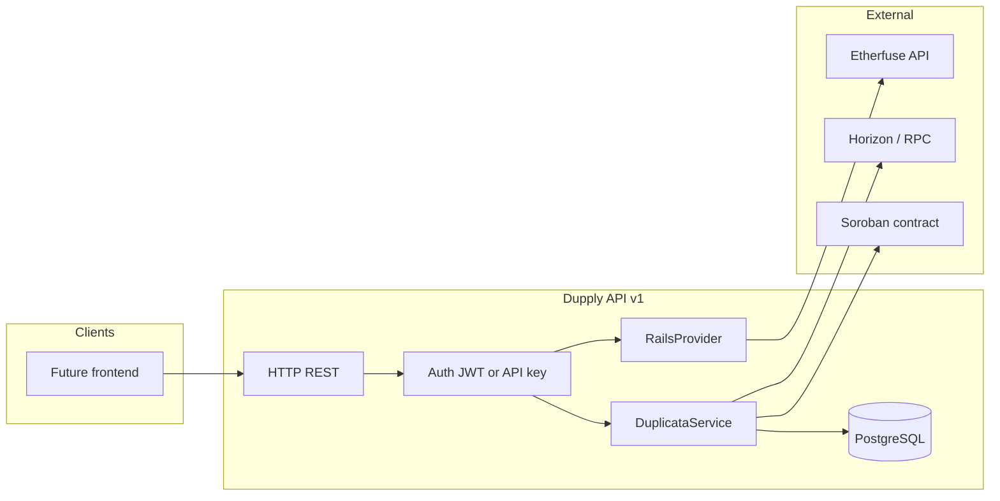

# Execution plan: Dupply backend v1 + ramp integration (Anchor / Etherfuse)

**Date:** 2026-05-16  
**Scope:** Define **v1** of the service in `dupply-backend` (API + persistence + jobs) and **one** initial **ramp/exchange** integration, with documented preference for **Etherfuse FX API**, while keeping the design **extensible** for **SEP-24 anchors** later.  
**Existing artifacts:** Soroban `DuplicataRegistry` contract (see `soroban/` and `soroban/DEPLOYMENT-testnet.md`); Node indexer skeleton in `packages/indexer/`.

---

## 1. Product goals for v1

| ID | Goal | Success measure |
|----|------|-----------------|
| O1 | Expose a secure REST API for the (future) frontend to orchestrate duplicatas | Published OpenAPI; minimal working auth |
| O2 | Persist off-chain business state | PostgreSQL (or SQLite in dev only) with migrations |
| O3 | Integrate **one** ramp provider | Sandbox flow: quote → order → persisted state |
| O4 | Correlate ramp with chain | Store `stellar_tx_hash` / `contract_id` / `duplicata_id` when applicable |
| O5 | Observability | Structured logs, health check, basic metrics |

**Explicitly out of scope v1:** new UI; centralized custody of user keys without a clear legal model; mainnet in production without a compliance review.

---

## 2. Target architecture (high level)



### 2.1 Suggested modules

1. **`packages/api/`** — routes, input validation, serialization, rate limiting.  
2. **`domain/duplicata/`** — business rules, internal IDs, link to indexer events.  
3. **`integrations/rails/`** — `RailsProvider` interface + `EtherfuseRailsProvider` implementation.  
4. **`integrations/stellar/`** — Horizon/RPC reads, XDR preparation (if the backend signs or only simulates).  
5. **`workers/`** — queue (e.g. BullMQ + Redis) for webhooks, order-state reconciliation.  
6. **`packages/indexer/`** — skeleton already exists; v1 may consume events and write to the same DB via internal API or shared library.

---

## 3. Recommended stack (provisional decision)

| Layer | Suggested choice | Rationale |
|-------|------------------|-----------|
| Runtime | Node.js 22 LTS | Matches existing `packages/indexer/` |
| Framework | Fastify or Hono | Performance, TS typing |
| ORM | Drizzle or Prisma | Migrations and type-safety |
| Auth | JWT (RS256) from this backend + optional refresh v2 | v1 simplicity |
| Queue | Redis + BullMQ | Webhooks and retries |
| Deploy | Docker + dev compose | Local/CI parity |

**Required ADR:** record the final framework and ORM choice in `docs/notes/` or root `DECISIONS.md` after a one-day spike.

---

## 4. Data model (v1 draft)

Minimum entities:

- **`users`** — external id (wallet `G...` or future OIDC subject), `created_at`.  
- **`duplicatas`** — fields mirroring the contract + `chain_duplicata_id` + `contract_address` + `network` (testnet/mainnet).  
- **`ramp_quotes`** — provider (`etherfuse`), request/response JSON payload, `expires_at`, status.  
- **`ramp_orders`** — `quote_id`, `external_order_id`, state, amounts, `user_id`.  
- **`chain_events`** — indexer cursor, `tx_hash`, normalized payload.

Indexes: `(external_order_id, provider)`, `(user_id, created_at)`.

---

## 5. Etherfuse integration (technical phases)

### Phase 0 — Spike (1–2 days)

- Create sandbox organization; generate API key.  
- `curl` script or `scripts/etherfuse-smoke.ts`: authentication → test quote → test order (per docs).  
- Document typical **HTTP status** codes and errors in `README` or `docs/notes`.

### Phase 1 — Internal HTTP client

- Client with: timeouts, exponential retries (429/5xx), **secret redaction** in logs.  
- TypeScript types generated from Etherfuse OpenAPI **if** available; otherwise minimal hand-written types.

### Phase 2 — Dupply endpoints

Illustrative route names:

- `POST /v1/ramp/quotes` — body: currency pair, amount; response: internal id + Etherfuse data.  
- `POST /v1/ramp/orders` — body: `quote_id` + confirmation; response: initial state.  
- `GET /v1/ramp/orders/:id` — consolidated state (DB + optional refresh from API).

### Phase 3 — Webhooks

- `POST /v1/webhooks/etherfuse` with signature verification (per docs).  
- Worker updates `ramp_orders` and emits internal notification (websocket v2).

### Phase 4 — Link to duplicata

- When `issue` is executed on chain (by client or by a backend-prepared transaction), store `duplicata_id` and `ramp_order_id` in the same DB transaction (eventual consistency).

---

## 6. “SEP-24 anchor” integration (later phase, design)

When an anchor from the **Anchor Directory** is required:

1. Resolve `HOME_DOMAIN` and `stellar.toml` (SEP-1).  
2. Implement **SEP-10** client (challenge → sign → JWT).  
3. Open **SEP-24** flow (deposit/withdraw) per [Wallet SEP-24](https://developers.stellar.org/docs/build/apps/wallet/sep24).  
4. Optional: UI redirect to anchor-hosted URL (Dupply frontend, when it exists, opens webview or browser).

Keep `Sep24RailsProvider` behind the same `RailsProvider` interface.

---

## 7. Environment variables (minimum list)

```bash
# API
DUPPLY_API_PORT=8080
DUPPLY_JWT_ISSUER=dupply-dev
DATABASE_URL=postgres://...

# Stellar
STELLAR_NETWORK=testnet
STELLAR_RPC_URL=https://soroban-testnet.stellar.org
STELLAR_HORIZON_URL=https://horizon-testnet.stellar.org
DUPPLY_REGISTRY_CONTRACT_ID=CCX3BC6KKA2GLWJT5HQ5J5DPLRYSCUNPS6DXISJEBYIPWHEJTJBYFRWC

# Etherfuse
ETHERFUSE_BASE_URL=https://api.sand.etherfuse.com
ETHERFUSE_API_KEY=...
ETHERFUSE_ORG_ID=...
ETHERFUSE_WEBHOOK_SECRET=...
```

**Note:** update the `CONTRACT_ID` above if redeployed; the source of truth remains `DEPLOYMENT-testnet.md`.

---

## 8. Tests and v1 acceptance criteria

1. **Unit:** `RailsProvider` with HTTP mock (nock/msw).  
2. **Integration:** optional CI tests against Etherfuse sandbox (secrets in GitHub Actions).  
3. **Contract:** existing Rust tests in the crate; CI runs `cargo test` on the contract path.  
4. **Manual acceptance:** checklist in `docs/notes/` with screenshots or `curl` for each route.

---

## 9. Risks and rollback

| Risk | Mitigation | Rollback |
|------|------------|----------|
| Etherfuse API changes | Versioned client + monitoring | Feature flag `RAILS_PROVIDER=none` |
| Cost / rate limits | Short quote cache, idempotency | Disable public route |
| Webhook security | Signature + replay window | Revoke secret |

---

## 10. Cross-documentation

- Stellar SEP / anchor research: `docs/research/2026-05-16_stellar-anchors-seps-and-directory.md`  
- Etherfuse research: `docs/research/2026-05-16_etherfuse-stellar-fx-api.md`

---

## References

1. Stellar — SEP-24 wallet — https://developers.stellar.org/docs/build/apps/wallet/sep24  
2. Stellar — Anchor Platform SEP-24 — https://developers.stellar.org/docs/platforms/anchor-platform/sep-guide/sep24/getting-started  
3. Etherfuse docs — https://docs.etherfuse.com/  
4. Stellar press Etherfuse — https://stellar.org/press/etherfuse-to-join-stellar-network-in-2025-ceo-david-taylor-announces-at-the-stellar-meridian-conference-in-london  
