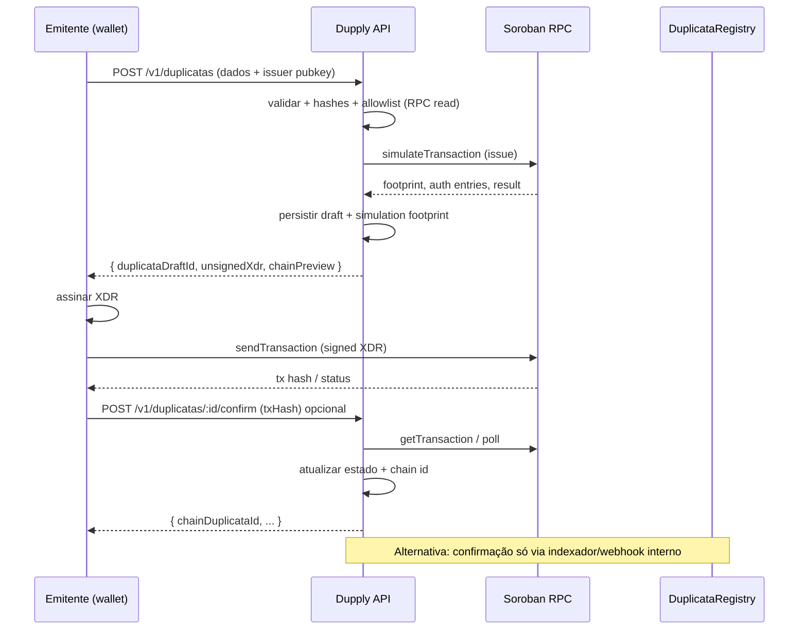

# Arquitetura v1 (restante): criação de duplicatas integrada ao contrato Soroban

**Data:** 2026-05-18  
**Âmbito:** planear apenas o **processo básico de criação** de duplicatas alinhado ao contrato `DuplicataRegistry`, **sem** expandir rampa/Etherfuse nem administração completa do registry.  
**Implementação:** ver código em `api/` — rotas `POST /v1/duplicatas`, `POST /v1/duplicatas/:id/confirm`, `GET /v1/duplicatas/:id`, `GET /v1/duplicatas/on-chain/:chainId`, bindings em `api/src/generated/duplicata-registry-contract.ts`.  
**Contrato de referência:** `contracts/duplicata-registry/contracts/duplicata-registry/src/` (`issue`, `IssuePayload`, `DuplicataIssued`, erros em `RegistryError`).  
**Documentação oficial Stellar / Soroban:** [Smart contracts — docs](https://developers.stellar.org/docs/build/smart-contracts), [RPC methods](https://developers.stellar.org/docs/data/apis/rpc/api-reference/methods), [Assemble transaction (Horizon legacy patterns)](https://developers.stellar.org/docs/build/guides/transactions) — para invocações Soroban usar **Soroban RPC** (`simulateTransaction`, `sendTransaction`).

---

## 1. Objetivo de produto (v1 “mínimo viável”)

Permitir que um **emitente autorizado** (conta Stellar clássica `G...` mapeada para `Address` no Soroban) **registe uma duplicata** no registry já deployado, com:

1. **Validação** off-chain espelhando invariantes do contrato (evitar XDR inútil e taxas falhadas).  
2. **Montagem** da invocação `issue(issuer, payload)` com `IssuePayload` coerente com `types.rs`.  
3. **Assinatura** pela chave do emitente (o contrato exige `issuer.require_auth()` em `issue` — ver `lib.rs`).  
4. **Submissão** à rede e **persistência** do estado em BD para consulta pela aplicação.  
5. **Correlação** opcional com o indexador existente (`DuplicataIssued`) para auditoria.

**Fora de escopo v1 (explícito):** `initialize` / `set_admin` / `set_issuer_allowed` via API pública (operações de admin continuam CLI ou rota interna muito restrita); armazenamento de **ficheiros** (PDFs de NF); gestão de sacado off-chain além do `sacado_commitment`; assinatura custodial no servidor.

---

## 2. Restrições impostas pelo contrato (não negociáveis)

| Regra | Origem | Implicação para o backend |
|--------|--------|---------------------------|
| `issuer.require_auth()` | `issue` | O **mesmo** `issuer` da chamada tem de **assinar** a transação Soroban (ou autorizar via custom account rules). O backend **não** pode “emitir por” o cliente sem a respetiva chave ou passarelle MPC acordada. |
| Allowlist | `is_issuer_allowed` | Antes de montar TX, o backend pode ler o contrato via RPC (`simulateTransaction` read-only ou `get_duplicata`-style helpers se expostos) para falhar cedo com `IssuerNotAllowed`. |
| `IssuePayload` | `types.rs` | O corpo HTTP da API deve mapear 1:1 para enums e campos (nomes estáveis para o front futuro). Hashes são `BytesN<32>` — **32 bytes fixos** (tipicamente SHA-256 de strings canónicas definidas pela Dupply). |
| Invariantes | `validate_payload` | Duplicar validação no servidor **antes** de `simulateTransaction` reduz custo e melhora mensagens (`InvalidAmounts`, `InvalidDates`, `FraudDeclarationsRequired`, `InvalidDiscountFlags`). |

Referência de domínio legível no repo: o README do crate aponta para tipos no frontend (`duplicata.types.ts`) — manter **contrato + types TS** como fonte de verdade dupla até existir pacote partilhado.

---

## 3. Modelo de integração recomendado (v1): “backend orquestra, carteira assina”



**Porque este modelo:** respeita `require_auth` do emitente, minimiza superfície de custódia e alinha com práticas comuns Stellar ([Stellar transaction lifecycle](https://developers.stellar.org/docs/learn/fundamentals/stellar-data-structures/operations-and-transactions)).

**Alternativa v1.1 (opcional):** se no futuro o emitente usar **smart wallet** (`C...`) com políticas, o fluxo de assinatura muda; o payload `issue` mantém-se — rever **SEP-45** / auth de contas contrato (já mencionado em `docs/research/2026-05-16_stellar-sep10-sep24-deep-dive.md`).

---

## 4. Camadas no pacote `api/`

| Módulo | Responsabilidade |
|--------|------------------|
| `domain/duplicata/` | Validação de negócio, normalização de datas para unix, regras de hashes, mapeamento DTO ↔ `IssuePayload` lógico. |
| `integrations/stellar/` | Cliente RPC (`fetch`/`rpc.Server`), leitura de contract spec (WASM id / contract id), `simulateTransaction`, preparação de `Operation.invokeContract`, decodificação de erros Soroban. |
| `integrations/registry/` | Funções de alto nível: `assertIssuerAllowed`, `buildIssueTransaction`, `parseIssueResult`. |
| `routes/v1/duplicatas.ts` | HTTP + Zod; **não** expor secrets. |
| `db/schema` (extensão) | Tabelas `duplicata_drafts` / `duplicata_chain_records` (nomes ilustrativos). |

Manter **rampa** (`ramp_*`) isolada: uma `duplicata_chain_record` pode referenciar opcionalmente `ramp_order_id` numa fase posterior (não v1 obrigatório).

---

## 5. Modelo de dados (SQLite / Postgres — mesmo schema Drizzle)

### 5.1 `duplicata_drafts`

Estado antes da confirmação on-chain.

| Coluna | Tipo | Notas |
|--------|------|--------|
| `id` | UUID | PK interna Dupply. |
| `issuer_public_key` | TEXT | Conta clássica `G...` (string); conversão para `Address` na montagem Soroban. |
| `status` | TEXT | `draft` \| `simulated` \| `submitted` \| `confirmed` \| `failed`. |
| `payload_json` | TEXT/JSON | Snapshot canónico enviado/recebido (sem PII em claro se política exigir só hashes). |
| `unsigned_xdr` | TEXT nullable | Última versão simulada (pode expirar — ver TTL simulação). |
| `simulation_ledger` | INT nullable | Para debugging. |
| `last_error` | TEXT nullable | Mensagem amigável + código contrato se parseável. |
| `created_at` / `updated_at` | TIMESTAMP | Auditoria. |

### 5.2 `duplicata_chain_records` (ou colunas extra no draft após confirmação)

| Coluna | Tipo | Notas |
|--------|------|--------|
| `draft_id` | UUID FK | |
| `network` | TEXT | `testnet` / `futurenet` / `mainnet`. |
| `contract_id` | TEXT | Mesmo conceito que `DUPPLY_REGISTRY_CONTRACT_ID` em env. |
| `chain_duplicata_id` | TEXT | `u64` serializado como string (evitar overflow JS). |
| `tx_hash` | TEXT | |
| `ledger` | INT nullable | |
| `issued_at_ledger` | INT nullable | Timestamp ledger se disponível no evento. |

**Índices:** `(tx_hash)`, `(chain_duplicata_id, contract_id, network)` único composto.

---

## 6. Contrato de API HTTP (proposta)

Todas as rotas abaixo sob o mesmo **`X-Dupply-Api-Key`** já usado em `/v1/ramp/*` (ou JWT v2 — fora do v1).

### 6.1 `POST /v1/duplicatas`

**Entrada (exemplo lógico — campos alinhados a `IssuePayload`):**

- Enums: `tipo`, `doc_fiscal_tipo`, `comprovante_tipo`, `status_aceite_sacado` (valores estáveis `mercantil` \| `servico`, etc., mapeados para `u32`/`enum` Soroban no cliente SDK).  
- Hashes: ou **hex de 64 chars** (32 bytes) **ou** strings a hashear com algoritmo documentado (preferir **hex fixo** no v1 para determinismo).  
- Valores: `valor_face_centavos`, `valor_max_antecipacao_centavos` (inteiros).  
- Datas: `data_emissao_unix`, `data_vencimento_unix`.  
- Flags: `doc_fiscal_anexado`, `comprovante_anexado`, `declaracoes_antifraude_aceitas`, `discount_eligible`.  
- `issuer_public_key`: `G...`.

**Processamento:**

1. Validar corpo (Zod) + invariantes espelhadas de `validate_payload`.  
2. Resolver `contract_id` e `rpc_url` de env.  
3. Opcional: `is_issuer_allowed` via simulação ou leitura — se o SDK expuser `get_duplicata` apenas, usar simulação de leitura ou método gerado a partir do spec.  
4. Construir `InvokeHostFunction` com argumentos Soroban (`issue` + `issuer` + `payload`).  
5. `simulateTransaction` — guardar footprint e XDR não assinado.  
6. Resposta: `{ id, status: "simulated", unsignedTransactionXdr, warnings[] }`.

**Erros HTTP:** `400` validação; `403` não allowlisted (pré-check); `502` RPC; `503` config em falta.

### 6.2 `POST /v1/duplicatas/:id/signed` (opcional no v1)

Se quiserem suportar **submissão pelo backend** (servidor com chave de canal / relayer só para fee, não para auth do issuer): **não cobre** `issuer.require_auth()` — em geral **não aplicável**. Preferir **não** implementar no v1.

### 6.3 `POST /v1/duplicatas/:id/confirm`

Corpo: `{ txHash }`. O backend faz `getTransaction` / polling curto, extrai `returnValue` (id `u64`) ou lê evento `DuplicataIssued`, atualiza `duplicata_chain_records`. Idempotente por `tx_hash`.

### 6.4 `GET /v1/duplicatas/:id`

Junta draft + registo on-chain (se existir). Opcionalmente enriquece com `get_duplicata` live.

### 6.5 `GET /v1/duplicatas/on-chain/:chainId`

Proxy de leitura (RPC) para debugging; pode ser `GET` com query `contract_id` se necessário.

---

## 7. Hashes e privacidade (`BytesN<32>`)

O contrato armazena apenas commitments. O plano Dupply deve **documentar num único sítio** (ex.: secção neste ficheiro ou `docs/research/`) a **canonização** das strings antes de SHA-256, por exemplo:

- `numero_duplicata`: normalizar (trim, NFC), prefixo de versão `dupply:v1:duplicata_number:` + valor.  
- Idem para `numero_fatura`, `doc_fiscal_chave`, `sacado` (ou identificador interno).

**Backend v1:** aceitar **já** `0x` ou hex de 64 caracteres para simplificar e evitar divergência cliente/servidor; campo opcional `hash_version` para evolução.

---

## 8. Stack técnica sugerida (Node, alinhada ao `api/` atual)

| Peça | Escolha | Notas |
|------|---------|--------|
| SDK | `@stellar/stellar-sdk` (v13+ com Soroban) | Oficial SDF; ver [npm](https://www.npmjs.com/package/@stellar/stellar-sdk) e changelog para RPC Soroban. |
| Contrato | Contract ID + **spec** gerado | Preferir `stellar contract bindings typescript` ou spec JSON commitado para tipos de `issue` — [CLI docs](https://developers.stellar.org/docs/tools/developer-tools/stellar-cli). |
| RPC | `SOROBAN_RPC_URL` (testnet) | Mesma rede que `DEPLOYMENT-testnet.md`. |

Variáveis de ambiente adicionais:

```bash
DUPPLY_REGISTRY_CONTRACT_ID=...
STELLAR_NETWORK=testnet
SOROBAN_RPC_URL=https://soroban-testnet.stellar.org
# opcional: HORIZON para histórico
STELLAR_HORIZON_URL=https://horizon-testnet.stellar.org
```

---

## 9. Indexador

O `indexer/` atual pode, numa sub-fase:

- consumir eventos `DuplicataIssued`;  
- escrever `chain_duplicata_id` + `tx_hash` (se a BD for partilhada ou via fila interna).

**v1 mínimo:** confirmar só por `POST .../confirm` sem alterar o indexador reduz escopo.

---

## 10. Segurança e compliance

- **API key** Dupply não substitui assinatura on-chain do emitente.  
- Não persistir **NF completa** em claro se não for necessário — só hashes + metadados.  
- Rate limit por `issuer_public_key` + IP nas rotas de simulação (custo RPC).  
- Logs sem XDR assinado nem chaves.

---

## 11. Critérios de aceitação (v1 duplicata)

1. Emitente na allowlist consegue obter `unsignedTransactionXdr` válido e submeter na testnet, resultando em `id` on-chain.  
2. Emitente fora da allowlist recebe erro claro **antes** ou na simulação com mapeamento de `IssuerNotAllowed`.  
3. Payload inválido (ex.: `declaracoes_antifraude_aceitas: false`) → `400` com código alinhado a `RegistryError`.  
4. `POST /confirm` idempotente e grava `tx_hash` + `chain_duplicata_id`.  
5. Testes automatizados: unitários validação + integração mock RPC (sem chaves reais em CI).

---

## 12. Fases de implementação sugeridas

| Fase | Entrega |
|------|---------|
| D1 | Schema Drizzle + rotas stub + Zod DTOs espelhando `IssuePayload`. |
| D2 | Cliente RPC + simulação `issue` + persistência `duplicata_drafts`. |
| D3 | `POST /confirm` + parsing de resultado / evento. |
| D4 | Testes + endurecimento de erros + documentação `api/README.md`. |
| D5 (opcional) | Indexador grava na mesma BD ou tópico interno. |

---

## 13. Riscos e mitigação

| Risco | Mitigação |
|-------|-----------|
| XDR / simulação expiram | Re-simular ao confirmar se `tx_hash` falhar; documentar TTL. |
| Divergência enum JSON ↔ contrato | Spec gerado + testes de contrato Rust existentes como referência. |
| JS `u64` | Usar `bigint` ou strings em toda a camada HTTP. |

---

## 14. Rollback

Feature flag `DUPLICATA_ROUTES_ENABLED=false` ou remover registo das rotas; dados em tabelas novas podem ser truncados sem afetar rampa nem contrato.

---

## Referências

1. Stellar — Smart contracts — https://developers.stellar.org/docs/build/smart-contracts  
2. Soroban RPC — `simulateTransaction` / `sendTransaction` — https://developers.stellar.org/docs/data/apis/rpc/api-reference/methods  
3. `duplicata-registry` README — `contracts/duplicata-registry/README.md`  
4. Plano geral v1 — `docs/notes/2026-05-16_dupply-backend-v1-plan.md`  
5. Stack API atual — `docs/notes/2026-05-17_dupply-api-stack.md`  
