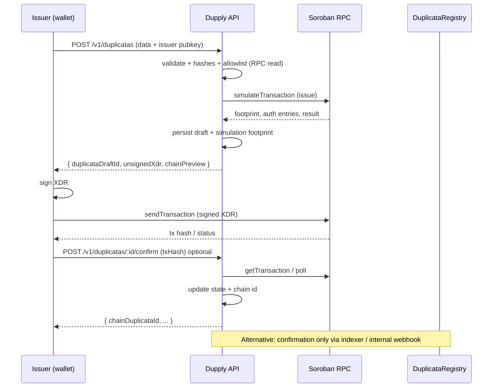

# v1 architecture (remainder): duplicata creation integrated with the Soroban contract

**Date:** 2026-05-18  
**Scope:** plan only the **basic creation flow** for duplicatas aligned with the `DuplicataRegistry` contract, **without** expanding ramp/Etherfuse or full registry administration.  
**Implementation:** see code under `api/` — routes `POST /v1/duplicatas`, `POST /v1/duplicatas/:id/confirm`, `GET /v1/duplicatas/:id`, `GET /v1/duplicatas/on-chain/:chainId`, bindings in `api/src/generated/duplicata-registry-contract.ts`.  
**Contract reference:** `contracts/duplicata-registry/contracts/duplicata-registry/src/` (`issue`, `IssuePayload`, `DuplicataIssued`, errors in `RegistryError`).  
**Official Stellar / Soroban docs:** [Smart contracts — docs](https://developers.stellar.org/docs/build/smart-contracts), [RPC methods](https://developers.stellar.org/docs/data/apis/rpc/api-reference/methods), [Assemble transaction (Horizon legacy patterns)](https://developers.stellar.org/docs/build/guides/transactions) — for Soroban invocations use **Soroban RPC** (`simulateTransaction`, `sendTransaction`).

---

## 1. Product goal (v1 “minimum viable”)

Allow an **authorized issuer** (classic Stellar account `G...` mapped to Soroban `Address`) to **register a duplicata** on the deployed registry, with:

1. **Off-chain validation** mirroring contract invariants (avoid useless XDR and failed fees).  
2. **Assembly** of the `issue(issuer, payload)` invocation with `IssuePayload` consistent with `types.rs`.  
3. **Signing** with the issuer key (the contract requires `issuer.require_auth()` in `issue` — see `lib.rs`).  
4. **Network submission** and **DB persistence** of state for app queries.  
5. **Optional correlation** with the existing indexer (`DuplicataIssued`) for audit.

**Explicitly out of scope v1:** `initialize` / `set_admin` / `set_issuer_allowed` via public API (admin remains CLI or a tightly restricted internal route); **file** storage (invoice PDFs); drawee off-chain management beyond `sacado_commitment`; custodial signing on the server.

---

## 2. Contract-imposed rules (non-negotiable)

| Rule | Source | Backend implication |
|------|--------|---------------------|
| `issuer.require_auth()` | `issue` | The **same** `issuer` as the call must **sign** the Soroban transaction (or authorize via custom account rules). The backend **cannot** “issue for” the client without that key or an agreed MPC pass-through. |
| Allowlist | `is_issuer_allowed` | Before assembling the TX, the backend may read the contract via RPC (`simulateTransaction` read-only or generated read helpers if exposed) to fail early with `IssuerNotAllowed`. |
| `IssuePayload` | `types.rs` | The HTTP body must map 1:1 to enums and fields (stable names for the future frontend). Hashes are `BytesN<32>` — **32 fixed bytes** (typically SHA-256 of Dupply-defined canonical strings). |
| Invariants | `validate_payload` | Duplicating validation on the server **before** `simulateTransaction` reduces cost and improves messages (`InvalidAmounts`, `InvalidDates`, `FraudDeclarationsRequired`, `InvalidDiscountFlags`). |

Human-readable domain reference in the repo: the crate README points to frontend types (`duplicata.types.ts`) — keep **contract + TS types** as dual source of truth until a shared package exists.

---

## 3. Recommended v1 integration model: “backend orchestrates, wallet signs”



**Why this model:** respects issuer `require_auth`, minimizes custody surface, and aligns with common Stellar practice ([Stellar transaction lifecycle](https://developers.stellar.org/docs/learn/fundamentals/stellar-data-structures/operations-and-transactions)).

**Optional v1.1:** if the issuer later uses a **`C...` smart wallet** with policies, the signing flow changes; the `issue` payload stays the same — revisit **SEP-45** / contract-account auth (already mentioned in `docs/research/2026-05-16_stellar-sep10-sep24-deep-dive.md`).

---

## 4. Layers in the `api/` package

| Module | Responsibility |
|--------|----------------|
| `domain/duplicata/` | Business validation, date normalization to unix, hash rules, DTO ↔ logical `IssuePayload` mapping. |
| `integrations/stellar/` | RPC client (`fetch` / `rpc.Server`), contract spec (WASM id / contract id), `simulateTransaction`, `Operation.invokeContract` prep, Soroban error decoding. |
| `integrations/registry/` | High-level helpers: `assertIssuerAllowed`, `buildIssueTransaction`, `parseIssueResult`. |
| `routes/v1/duplicatas.ts` | HTTP + Zod; **do not** expose secrets. |
| `db/schema` (extension) | Tables `duplicata_drafts` / `duplicata_chain_records` (illustrative names). |

Keep **ramp** (`ramp_*`) isolated: a `duplicata_chain_record` may optionally reference `ramp_order_id` in a later phase (not mandatory in v1).

---

## 5. Data model (SQLite / Postgres — same Drizzle schema)

### 5.1 `duplicata_drafts`

State before on-chain confirmation.

| Column | Type | Notes |
|--------|------|--------|
| `id` | UUID | Internal Dupply PK. |
| `issuer_public_key` | TEXT | Classic account `G...` (string); convert to `Address` when assembling Soroban. |
| `status` | TEXT | `draft` \| `simulated` \| `submitted` \| `confirmed` \| `failed`. |
| `payload_json` | TEXT/JSON | Canonical snapshot sent/received (no raw PII if policy requires hashes only). |
| `unsigned_xdr` | TEXT nullable | Last simulated version (may expire — see simulation TTL). |
| `simulation_ledger` | INT nullable | Debugging. |
| `last_error` | TEXT nullable | Friendly message + contract code if parseable. |
| `created_at` / `updated_at` | TIMESTAMP | Audit. |

### 5.2 `duplicata_chain_records` (or extra columns on draft after confirmation)

| Column | Type | Notes |
|--------|------|--------|
| `draft_id` | UUID FK | |
| `network` | TEXT | `testnet` / `futurenet` / `mainnet`. |
| `contract_id` | TEXT | Same concept as `DUPPLY_REGISTRY_CONTRACT_ID` in env. |
| `chain_duplicata_id` | TEXT | `u64` serialized as string (avoid JS overflow). |
| `tx_hash` | TEXT | |
| `ledger` | INT nullable | |
| `issued_at_ledger` | INT nullable | Ledger timestamp if available from event. |

**Indexes:** `(tx_hash)`, unique composite `(chain_duplicata_id, contract_id, network)`.

---

## 6. HTTP API contract (proposal)

All routes below use the same **`X-Dupply-Api-Key`** as `/v1/ramp/*` (or JWT in v2 — outside v1).

### 6.1 `POST /v1/duplicatas`

**Input (logical example — field names match `CreateDuplicataBody` / `IssuePayload`):**

- `issuerPublicKey`: classic `G...`.  
- `tipo`: `mercantil` \| `servico`.  
- Hashes (64 hex chars = 32 bytes): `numeroDuplicataHash`, `numeroFaturaHash`, `docFiscalChaveHash`, `sacadoCommitment`.  
- `docFiscalTipo`: `nfe` \| `nfce` \| `nfse` \| `outro`.  
- `comprovanteTipo`: `entrega` \| `aceite` \| `prestacao_servico`.  
- `statusAceiteSacado`: `aceito` \| `pendente` \| `recusado`.  
- Amounts: `valorFaceCentavos`, `valorMaxAntecipacaoCentavos` (decimal strings, arbitrary precision).  
- Dates: `dataEmissaoUnix`, `dataVencimentoUnix` (non-negative integers, unix seconds).  
- Flags: `docFiscalAnexado`, `comprovanteAnexado`, `declaracoesAntifraudeAceitas`, `discountEligible`.

**Processing:**

1. Validate body (Zod) + invariants mirroring `validate_payload`.  
2. Resolve `contract_id` and RPC URL from env.  
3. Optional: `is_issuer_allowed` via simulation or read — if the SDK only exposes `get_duplicata`, use read simulation or a method generated from spec.  
4. Build `InvokeHostFunction` with Soroban args (`issue` + `issuer` + `payload`).  
5. `simulateTransaction` — store footprint and unsigned XDR.  
6. Response: `{ id, status: "simulated", unsignedTransactionXdr, warnings[] }`.

**HTTP errors:** `400` validation; `403` not allowlisted (pre-check); `502` RPC; `503` missing config.

### 6.2 `POST /v1/duplicatas/:id/signed` (optional in v1)

If you want **backend submission** (server channel key / relayer for fees only, not issuer auth): it does **not** satisfy `issuer.require_auth()` — generally **not applicable**. Prefer **not** implementing in v1.

### 6.3 `POST /v1/duplicatas/:id/confirm`

Body: `{ txHash }`. Backend runs `getTransaction` / short polling, extracts `returnValue` ( `u64` id) or reads `DuplicataIssued`, updates `duplicata_chain_records`. Idempotent by `tx_hash`.

### 6.4 `GET /v1/duplicatas/:id`

Joins draft + on-chain record (if any). Optionally enriches with live `get_duplicata`.

### 6.5 `GET /v1/duplicatas/on-chain/:chainId`

Read proxy (RPC) for debugging; may be `GET` with `contract_id` query if needed.

---

## 7. Hashes and privacy (`BytesN<32>`)

The contract stores only commitments. The Dupply plan should **document in one place** (e.g. a section here or under `docs/research/`) **canonicalization** of strings before SHA-256, for example:

- `numero_duplicata`: normalize (trim, NFC), version prefix `dupply:v1:duplicata_number:` + value.  
- Same pattern for invoice number, fiscal doc key, drawee (or internal id).

**Backend v1:** accept **64-character hex** (or `0x` prefix) to simplify and avoid client/server divergence; optional `hashVersion` field for evolution.

---

## 8. Suggested technical stack (Node, aligned with current `api/`)

| Piece | Choice | Notes |
|-------|--------|--------|
| SDK | `@stellar/stellar-sdk` (v13+ with Soroban) | Official SDF; see [npm](https://www.npmjs.com/package/@stellar/stellar-sdk) and changelog for Soroban RPC. |
| Contract | Contract ID + **generated spec** | Prefer `stellar contract bindings typescript` or committed JSON spec for `issue` types — [CLI docs](https://developers.stellar.org/docs/tools/developer-tools/stellar-cli). |
| RPC | `SOROBAN_RPC_URL` (testnet) | Same network as `DEPLOYMENT-testnet.md`. |

Additional environment variables:

```bash
DUPPLY_REGISTRY_CONTRACT_ID=...
STELLAR_NETWORK=testnet
SOROBAN_RPC_URL=https://soroban-testnet.stellar.org
# optional: HORIZON for history
STELLAR_HORIZON_URL=https://horizon-testnet.stellar.org
```

---

## 9. Indexer

Current `indexer/` may, in a sub-phase:

- consume `DuplicataIssued` events;  
- write `chain_duplicata_id` + `tx_hash` (if DB is shared or via internal queue).

**Minimal v1:** confirm only via `POST .../confirm` without changing the indexer reduces scope.

---

## 10. Security and compliance

- Dupply **API key** does not replace on-chain issuer signature.  
- Do not persist full **invoice** in clear text if unnecessary — hashes + metadata only.  
- Rate limit by `issuerPublicKey` + IP on simulation routes (RPC cost).  
- Logs without signed XDR or keys.

---

## 11. Acceptance criteria (v1 duplicata)

1. Allowlisted issuer obtains valid `unsignedTransactionXdr` and submits on testnet, yielding on-chain `id`.  
2. Non-allowlisted issuer gets a clear error **before** or in simulation with `IssuerNotAllowed` mapping.  
3. Invalid payload (e.g. `declaracoesAntifraudeAceitas: false`) → `400` with code aligned to `RegistryError`.  
4. `POST /confirm` is idempotent and stores `tx_hash` + `chain_duplicata_id`.  
5. Automated tests: unit validation + integration with mocked RPC (no real keys in CI).

---

## 12. Suggested implementation phases

| Phase | Deliverable |
|-------|-------------|
| D1 | Drizzle schema + stub routes + Zod DTOs mirroring `IssuePayload`. |
| D2 | RPC client + `issue` simulation + `duplicata_drafts` persistence. |
| D3 | `POST /confirm` + result / event parsing. |
| D4 | Tests + error hardening + `api/README.md` documentation. |
| D5 (optional) | Indexer writes to same DB or internal topic. |

---

## 13. Risks and mitigation

| Risk | Mitigation |
|------|------------|
| XDR / simulation expiry | Re-simulate on confirm if `tx_hash` fails; document TTL. |
| JSON enum drift ↔ contract | Generated spec + existing Rust contract tests as reference. |
| JS `u64` | Use `bigint` or strings across the HTTP layer. |

---

## 14. Rollback

Feature flag `DUPLICATA_ROUTES_ENABLED=false` or unregister routes; data in new tables can be truncated without affecting ramp or contract.

---

## References

1. Stellar — Smart contracts — https://developers.stellar.org/docs/build/smart-contracts  
2. Soroban RPC — `simulateTransaction` / `sendTransaction` — https://developers.stellar.org/docs/data/apis/rpc/api-reference/methods  
3. `duplicata-registry` README — `contracts/duplicata-registry/README.md`  
4. General v1 plan — `docs/notes/2026-05-16_dupply-backend-v1-plan.md`  
5. Current API stack — `docs/notes/2026-05-17_dupply-api-stack.md`  
